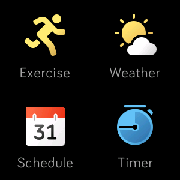
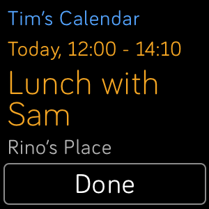
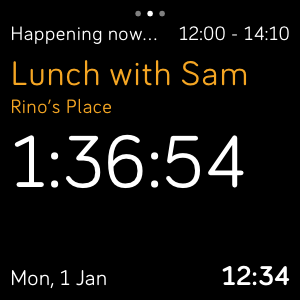
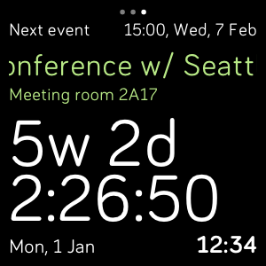
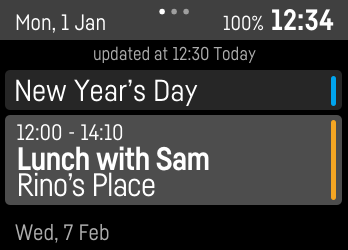
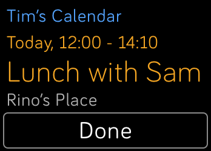
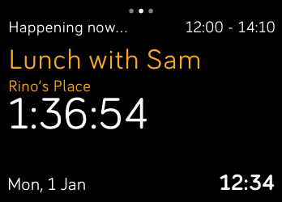
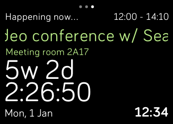

# Schedule

A schedule viewer for Fitbit OS 2.

## Install

1. Tap [here](https://gam.fitbit.com/gallery/app/38b688ed-0ff1-40cc-a906-5a9a50852740) to redirect to Fitbit App gallery. (Mobile only).
2. Log in to your Google account in the Schedule app settings.

## Features
- [x] Support Fitbit Versa and Fitbit Ionic.
- [x] Support Google Calendar
    - [x] Show multiple calendars together (only calendars turned on in Google Calendar settings are shown)
- [x] Color coded events
- [x] Detail page showing event title, time and location.
- [x] Countdown to the end of current event
- [x] Countdown to the start of next event

## Usage
- Tap event block to show details
- Swipe to the right to show countdowns
- Tap the status bar to force refresh

## Screenshots

| Versa | | |
| - | - | - |
|  |  |  |
|  |  | |

| Ionic | |
| - | - |
|  |  |
|  |  |

## Plan

- [ ] Multilingual support
- [ ] Other calendar service support (Outlook, etc.)
- [ ] Theming

## License

    Schedule, a schedule viewer for Fitbit OS 2.
    Copyright (C) 2018 Eana Hufwe

    This program is free software: you can redistribute it and/or modify
    it under the terms of the GNU General Public License as published by
    the Free Software Foundation, either version 3 of the License, or
    (at your option) any later version.

    This program is distributed in the hope that it will be useful,
    but WITHOUT ANY WARRANTY; without even the implied warranty of
    MERCHANTABILITY or FITNESS FOR A PARTICULAR PURPOSE.  See the
    GNU General Public License for more details.

    You should have received a copy of the GNU General Public License
    along with this program.  If not, see <https://www.gnu.org/licenses/>.